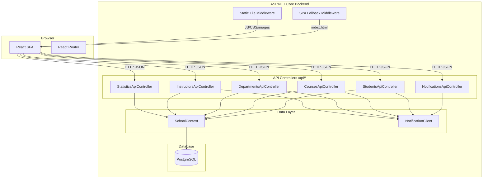

# Design Document: SPA Migration

## Overview

This design covers the migration of the Contoso University application from an ASP.NET MVC architecture with server-rendered Razor Views to a modern Single Page Application (SPA) architecture. The backend will expose REST API controllers under the `/api` prefix, and a React frontend will replace all Razor Views, communicating with these APIs via HTTP/JSON.

The migration preserves all existing functionality — Students, Courses, Departments, Instructors, Statistics (About page), and Notifications — while delivering a client-side rendered, responsive user experience with no full-page reloads during navigation.

### Key Design Decisions

1. **Co-located frontend**: The React app lives within the ASP.NET Core project under a `ClientApp/` directory. In production, the built React output is served from `wwwroot`. In development, requests are proxied to the React dev server for hot module replacement.

2. **API prefix convention**: All REST endpoints live under `/api/{entity}`. Non-API, non-static-file requests fall through to the SPA fallback serving `index.html`.

3. **Existing data layer preserved**: The Entity Framework Core models, `SchoolContext`, and `PaginatedList<T>` helper remain unchanged. New API controllers consume them directly.

4. **Notification service integration unchanged**: The existing `NotificationClient` service is reused by the new API controllers with the same fire-and-forget, failure-tolerant pattern.

5. **React with TypeScript**: The frontend uses React 18+ with TypeScript for type safety, React Router for client-side routing, and a lightweight fetching layer (fetch API or axios).

## Architecture



### Middleware Pipeline Order

1. `UseHttpsRedirection()`
2. `UseStaticFiles()` — serves built React assets from `wwwroot`
3. `UseRouting()`
4. `UseAuthorization()`
5. `MapControllers()` — maps attribute-routed API controllers
6. SPA Fallback — returns `index.html` for any unmatched GET request (non-API, non-static-file)

In development mode, the SPA development server proxy replaces the static-file + fallback for non-API routes.

## Components and Interfaces

### Backend API Controllers

Each API controller is an `[ApiController]` with `[Route("api/[controller]")]` attribute routing. They replace the existing MVC controllers which return views.

#### StudentsApiController

| Method | Route | Description |
|--------|-------|-------------|
| GET | `/api/students?sortOrder=&searchString=&page=` | Paginated, sorted, filtered list |
| GET | `/api/students/{id}` | Student details with enrollments |
| POST | `/api/students` | Create student |
| PUT | `/api/students/{id}` | Update student |
| DELETE | `/api/students/{id}` | Delete student |

#### CoursesApiController

| Method | Route | Description |
|--------|-------|-------------|
| GET | `/api/courses` | All courses with department names |
| GET | `/api/courses/{id}` | Course details |
| POST | `/api/courses` | Create course (multipart for image) |
| PUT | `/api/courses/{id}` | Update course (multipart for image) |
| DELETE | `/api/courses/{id}` | Delete course and associated image |

#### DepartmentsApiController

| Method | Route | Description |
|--------|-------|-------------|
| GET | `/api/departments` | All departments with administrator names |
| GET | `/api/departments/{id}` | Department details with RowVersion |
| POST | `/api/departments` | Create department |
| PUT | `/api/departments/{id}` | Update department (concurrency-aware) |
| DELETE | `/api/departments/{id}` | Delete department |

#### InstructorsApiController

| Method | Route | Description |
|--------|-------|-------------|
| GET | `/api/instructors` | All instructors with office/courses |
| GET | `/api/instructors/{id}?courseId=` | Instructor detail, optionally with enrollments |
| POST | `/api/instructors` | Create instructor with courses/office |
| PUT | `/api/instructors/{id}` | Update instructor, courses, office |
| DELETE | `/api/instructors/{id}` | Delete instructor, null-out department refs |

#### StatisticsApiController

| Method | Route | Description |
|--------|-------|-------------|
| GET | `/api/statistics/enrollment-stats` | Enrollment date group aggregation |

#### NotificationsApiController

| Method | Route | Description |
|--------|-------|-------------|
| GET | `/api/notifications` | Pending notifications (max 10) + unread count |
| POST | `/api/notifications/{id}/mark-read` | Mark a notification as read |

### React Frontend Components

```mermaid
graph TD
    App[App] --> Layout[Layout]
    Layout --> NavBar[NavBar + NotificationBell]
    Layout --> RouterOutlet[Router Outlet]
    
    RouterOutlet --> HomePage[HomePage]
    RouterOutlet --> AboutPage[AboutPage]
    RouterOutlet --> StudentPages[Student Pages]
    RouterOutlet --> CoursePages[Course Pages]
    RouterOutlet --> DepartmentPages[Department Pages]
    RouterOutlet --> InstructorPages[Instructor Pages]
    RouterOutlet --> NotFoundPage[NotFoundPage]

    StudentPages --> StudentList[StudentList]
    StudentPages --> StudentCreate[StudentCreate]
    StudentPages --> StudentEdit[StudentEdit]
    StudentPages --> StudentDetails[StudentDetails]
    StudentPages --> StudentDelete[StudentDelete]

    CoursePages --> CourseList[CourseList]
    CoursePages --> CourseCreate[CourseCreate]
    CoursePages --> CourseEdit[CourseEdit]
    CoursePages --> CourseDetails[CourseDetails]
    CoursePages --> CourseDelete[CourseDelete]

    DepartmentPages --> DepartmentList[DepartmentList]
    DepartmentPages --> DepartmentCreate[DepartmentCreate]
    DepartmentPages --> DepartmentEdit[DepartmentEdit]
    DepartmentPages --> DepartmentDelete[DepartmentDelete]

    InstructorPages --> InstructorList[InstructorList]
    InstructorPages --> InstructorCreate[InstructorCreate]
    InstructorPages --> InstructorEdit[InstructorEdit]
    InstructorPages --> InstructorDelete[InstructorDelete]
```



### Shared React Utilities

| Module | Purpose |
|--------|---------|
| `apiClient.ts` | Centralized fetch wrapper with base URL, error handling, JSON parsing |
| `types.ts` | TypeScript interfaces matching API response shapes |
| `useApi.ts` | Custom hook for data fetching with loading/error state |
| `Pagination.tsx` | Reusable pagination component |
| `FormField.tsx` | Reusable form field with validation error display |
| `ConfirmDelete.tsx` | Reusable delete confirmation pattern |
| `ErrorMessage.tsx` | Reusable error display component |

## Data Models

### API DTOs (Data Transfer Objects)

The API controllers will use DTOs to decouple the API contract from the EF entity models. This prevents over-posting and provides explicit control over serialization.

```csharp
// Student DTOs
public record StudentListItemDto(int Id, string LastName, string FirstMidName, DateTime EnrollmentDate);

public record StudentDetailDto(
    int Id, string LastName, string FirstMidName, DateTime EnrollmentDate,
    List<EnrollmentDto> Enrollments);

public record EnrollmentDto(int EnrollmentId, string CourseTitle, int CourseId, string? Grade);

public record StudentCreateDto
{
    [Required, StringLength(50)] public string LastName { get; init; }
    [Required, StringLength(50)] public string FirstMidName { get; init; }
    [Required] public DateTime EnrollmentDate { get; init; }
}

public record StudentUpdateDto : StudentCreateDto
{
    [Required] public int Id { get; init; }
}

// Course DTOs
public record CourseListItemDto(int CourseId, string Title, int Credits, string DepartmentName);

public record CourseDetailDto(
    int CourseId, string Title, int Credits, int DepartmentId,
    string DepartmentName, string? TeachingMaterialImagePath);

public record CourseCreateDto
{
    [Required] public int CourseId { get; init; }
    [Required, StringLength(50, MinimumLength = 3)] public string Title { get; init; }
    [Range(0, 5)] public int Credits { get; init; }
    [Required] public int DepartmentId { get; init; }
}

public record CourseUpdateDto
{
    [Required, StringLength(50, MinimumLength = 3)] public string Title { get; init; }
    [Range(0, 5)] public int Credits { get; init; }
    [Required] public int DepartmentId { get; init; }
}

// Department DTOs
public record DepartmentListItemDto(
    int DepartmentId, string Name, decimal Budget, DateTime StartDate, string? AdministratorName);

public record DepartmentDetailDto(
    int DepartmentId, string Name, decimal Budget, DateTime StartDate,
    int? InstructorId, byte[] RowVersion);

public record DepartmentCreateDto
{
    [Required, StringLength(50, MinimumLength = 3)] public string Name { get; init; }
    [Required] public decimal Budget { get; init; }
    [Required] public DateTime StartDate { get; init; }
    public int? InstructorId { get; init; }
}

public record DepartmentUpdateDto : DepartmentCreateDto
{
    [Required] public byte[] RowVersion { get; init; }
}

public record DepartmentConflictDto(
    string CurrentName, decimal CurrentBudget, DateTime CurrentStartDate,
    string? CurrentAdministratorName, byte[] CurrentRowVersion);

// Instructor DTOs
public record InstructorListItemDto(
    int Id, string LastName, string FirstMidName, DateTime HireDate,
    string? OfficeLocation, List<CourseAssignmentDto> Courses);

public record CourseAssignmentDto(int CourseId, string Title, string DepartmentName);

public record InstructorDetailDto(
    int Id, string LastName, string FirstMidName, DateTime HireDate,
    string? OfficeLocation, List<CourseAssignmentDto> Courses,
    List<CourseEnrollmentDto>? SelectedCourseEnrollments);

public record CourseEnrollmentDto(string StudentName, string? Grade);

public record InstructorCreateDto
{
    [Required, StringLength(50)] public string LastName { get; init; }
    [Required, StringLength(50)] public string FirstMidName { get; init; }
    [Required] public DateTime HireDate { get; init; }
    [StringLength(50)] public string? OfficeLocation { get; init; }
    public List<int> SelectedCourseIds { get; init; } = new();
}

public record InstructorUpdateDto : InstructorCreateDto;

// Statistics DTOs
public record EnrollmentStatDto(DateTime EnrollmentDate, int StudentCount);

// Notification DTOs
public record NotificationListDto(List<NotificationItemDto> Notifications, int UnreadCount);

public record NotificationItemDto(
    int Id, string EntityType, string Operation, string? EntityDisplayName, DateTime Timestamp);

// Paginated response wrapper
public record PaginatedResponse<T>(
    List<T> Items, int TotalCount, int PageNumber, int TotalPages);

// Validation error response
public record ValidationErrorResponse(Dictionary<string, string[]> Errors);
```

### TypeScript Interfaces (Frontend)

```typescript
// Matches backend DTOs
interface StudentListItem {
  id: number;
  lastName: string;
  firstMidName: string;
  enrollmentDate: string;
}

interface PaginatedResponse<T> {
  items: T[];
  totalCount: number;
  pageNumber: number;
  totalPages: number;
}

interface CourseListItem {
  courseId: number;
  title: string;
  credits: number;
  departmentName: string;
}

interface DepartmentListItem {
  departmentId: number;
  name: string;
  budget: number;
  startDate: string;
  administratorName: string | null;
}

interface DepartmentDetail {
  departmentId: number;
  name: string;
  budget: number;
  startDate: string;
  instructorId: number | null;
  rowVersion: string; // Base64-encoded
}

interface DepartmentConflict {
  currentName: string;
  currentBudget: number;
  currentStartDate: string;
  currentAdministratorName: string | null;
  currentRowVersion: string;
}

interface InstructorListItem {
  id: number;
  lastName: string;
  firstMidName: string;
  hireDate: string;
  officeLocation: string | null;
  courses: CourseAssignment[];
}

interface CourseAssignment {
  courseId: number;
  title: string;
  departmentName: string;
}

interface NotificationList {
  notifications: NotificationItem[];
  unreadCount: number;
}

interface NotificationItem {
  id: number;
  entityType: string;
  operation: string;
  entityDisplayName: string | null;
  timestamp: string;
}

interface ValidationErrors {
  [field: string]: string[];
}
```

### Existing EF Models (Unchanged)

The following Entity Framework models remain unchanged:
- `Student` (extends `Person`) — with `EnrollmentDate` and `Enrollments` collection
- `Course` — with `CourseID`, `Title`, `Credits`, `DepartmentID`, `TeachingMaterialImagePath`
- `Department` — with `RowVersion` for optimistic concurrency
- `Instructor` (extends `Person`) — with `HireDate`, `CourseAssignments`, `OfficeAssignment`
- `Enrollment` — join between `Student` and `Course` with nullable `Grade`
- `CourseAssignment` — many-to-many join between `Instructor` and `Course`
- `OfficeAssignment` — one-to-one with `Instructor`


## Correctness Properties

*A property is a characteristic or behavior that should hold true across all valid executions of a system — essentially, a formal statement about what the system should do. Properties serve as the bridge between human-readable specifications and machine-verifiable correctness guarantees.*

### Property 1: Pagination invariants

*For any* set of student records and any combination of sort order, search filter, and page number, the Student_API index response SHALL satisfy: (a) the number of returned items is at most the page size (10), (b) the reported `totalCount` equals the number of students matching the filter, (c) `totalPages` equals `ceil(totalCount / pageSize)`, and (d) items are sorted according to the requested sort order (LastName ascending by default).

**Validates: Requirements 1.1**

### Property 2: Student CRUD round trip

*For any* valid student data (LastName 1-50 chars, FirstMidName 1-50 chars, EnrollmentDate within 1753-01-01 to 9999-12-31), creating a student via POST and then retrieving it via GET SHALL return the same LastName, FirstMidName, and EnrollmentDate; similarly, updating a student via PUT and then retrieving it SHALL reflect the updated values exactly.

**Validates: Requirements 1.3, 1.4**

### Property 3: Student validation rejection

*For any* student input where LastName exceeds 50 characters, FirstMidName exceeds 50 characters, a required field is missing, or EnrollmentDate is outside 1753-01-01 to 9999-12-31, the Student_API SHALL return a 400 status with a JSON body containing a dictionary where at least one key corresponds to the invalid field name and maps to a non-empty array of error strings.

**Validates: Requirements 1.6, 13.3**

### Property 4: Course CRUD round trip

*For any* valid course data (Title 3-50 chars, Credits 0-5, existing DepartmentID), creating a course via POST and then retrieving it via GET SHALL return the same Title, Credits, and DepartmentID; similarly, updating via PUT and retrieving SHALL reflect the updated values exactly.

**Validates: Requirements 2.3, 2.6**

### Property 5: Course file upload validation

*For any* file with an extension not in {jpg, jpeg, png, gif, bmp} or with a size exceeding 5MB, the Course_API SHALL reject the upload with a 400 status and an error message indicating either invalid file type or size exceeded.

**Validates: Requirements 2.4, 2.5**

### Property 6: Course validation rejection

*For any* course input where Title is outside 3-50 characters, Credits is outside 0-5, or DepartmentID references a non-existent department, the Course_API SHALL return a 400 status with field-specific error messages.

**Validates: Requirements 2.9, 13.3**

### Property 7: Department CRUD round trip

*For any* valid department data (Name 3-50 chars, decimal Budget, valid StartDate), creating via POST and retrieving SHALL return the same values; updating via PUT with a matching RowVersion and retrieving SHALL reflect the updated values and produce a new RowVersion.

**Validates: Requirements 3.3, 3.4**

### Property 8: Department validation rejection

*For any* department input where Name is outside 3-50 characters or required fields are missing, the Department_API SHALL return a 400 status with field-specific error messages.

**Validates: Requirements 3.8, 13.3**

### Property 9: Instructor list ordering

*For any* set of instructor records, the Instructor_API index endpoint SHALL return them ordered by LastName ascending — i.e., for every consecutive pair of instructors in the response, the first instructor's LastName is lexicographically less than or equal to the second's.

**Validates: Requirements 4.1**

### Property 10: Instructor CRUD round trip with course assignment replacement

*For any* valid instructor data (LastName 1-50 chars, FirstMidName 1-50 chars, valid HireDate, optional OfficeLocation 0-50 chars, and a subset of existing course IDs), creating via POST and retrieving SHALL return matching values with exactly the specified course assignments; updating via PUT with a different set of course IDs SHALL result in the instructor having exactly and only the newly specified courses.

**Validates: Requirements 4.3, 4.4**

### Property 11: Instructor validation rejection

*For any* instructor input where LastName exceeds 50 characters, FirstMidName exceeds 50 characters, or required fields are missing, the Instructor_API SHALL return a 400 status with field-specific error messages.

**Validates: Requirements 4.8, 13.3**

### Property 12: Statistics aggregation correctness

*For any* set of student records, the Statistics_API enrollment-stats endpoint SHALL return enrollment date groups that are (a) sorted by enrollment date ascending, (b) each group's student count equals the actual number of students with that enrollment date, and (c) the sum of all group counts equals the total number of students.

**Validates: Requirements 5.1**

### Property 13: Notification count display

*For any* non-negative integer unread notification count, the notification indicator SHALL display the exact count as a string when the count is 99 or less, and SHALL display "99+" when the count exceeds 99.

**Validates: Requirements 12.1**

### Property 14: API response structure conventions

*For any* successful API request, the response SHALL satisfy: (a) GET and PUT responses return status 200, POST responses return 201, DELETE responses return 204, (b) all responses with a JSON body include `Content-Type: application/json` header, and (c) DELETE responses have no body.

**Validates: Requirements 13.1, 13.2, 13.6**

## Error Handling

### Backend Error Handling Strategy

| Scenario | HTTP Status | Response Body | Notes |
|----------|-------------|---------------|-------|
| Validation failure | 400 | `{ "fieldName": ["error1", ...] }` | Empty string key for non-field errors |
| Resource not found | 404 | `{ "error": "Student with ID 42 not found" }` | Entity type + ID in message |
| Concurrency conflict | 409 | `DepartmentConflictDto` with current DB values | Departments only |
| Notification service down | N/A | Operation succeeds normally | Fire-and-forget, errors swallowed |
| Database error | 500 | `{ "error": "An unexpected error occurred" }` | No internals exposed |
| Notification API unavailable (direct query) | 503 | `{ "message": "Notification service unavailable" }` | Only for NotificationsApiController |
| Dev server unreachable | 502 | Error message | Development mode only |

### Backend Implementation

```csharp
// Global exception handler middleware
public class ApiExceptionMiddleware
{
    public async Task InvokeAsync(HttpContext context, RequestDelegate next)
    {
        try
        {
            await next(context);
        }
        catch (Exception ex)
        {
            if (context.Request.Path.StartsWithSegments("/api"))
            {
                context.Response.StatusCode = 500;
                context.Response.ContentType = "application/json";
                await context.Response.WriteAsJsonAsync(new { error = "An unexpected error occurred." });
            }
            else throw; // Let SPA fallback handle non-API errors
        }
    }
}
```

### Frontend Error Handling Strategy

| Scenario | UI Behavior |
|----------|-------------|
| 400 validation errors | Display field-specific errors next to form fields; non-field errors at form top |
| 404 not found | Navigate to not-found page or display "resource not found" message |
| 409 concurrency conflict | Display conflict resolution UI (departments) |
| 500 server error | Display generic error banner, preserve user-entered form data |
| Network unreachable | Display "unable to connect" message, preserve form data |
| Notification poll failure | Retain last known count, retry on next interval |

### Frontend API Client Error Handling

```typescript
class ApiError extends Error {
  constructor(
    public status: number,
    public body: unknown,
    message?: string
  ) {
    super(message ?? `API error: ${status}`);
  }
}

async function apiRequest<T>(url: string, options?: RequestInit): Promise<T> {
  const response = await fetch(url, {
    ...options,
    headers: { 'Content-Type': 'application/json', ...options?.headers }
  });
  
  if (!response.ok) {
    const body = await response.json().catch(() => null);
    throw new ApiError(response.status, body);
  }
  
  if (response.status === 204) return undefined as T;
  return response.json();
}
```

## Testing Strategy

### Property-Based Testing

This feature is suitable for property-based testing on the API controller layer. The controllers contain business logic for validation, pagination, sorting, filtering, and data transformation that benefits from testing across many generated inputs.

**Library**: [FsCheck](https://fscheck.github.io/FsCheck/) for .NET (integrates with xUnit)

**Configuration**:
- Minimum 100 iterations per property test
- Each property test references its design document property via tag comment
- Tag format: `// Feature: spa-migration, Property {number}: {property_text}`

**Property tests cover:**
- Pagination invariants (page size, total count, sort order)
- CRUD round trips for all entities (create/update then retrieve preserves data)
- Validation rejection (invalid inputs always produce 400 with field errors)
- Ordering invariants (instructor list, statistics dates)
- File upload validation (invalid types/sizes always rejected)
- API response structure (correct status codes and content-type headers)
- Notification display logic (count or "99+")

### Unit Testing (Example-Based)

Unit tests complement property tests for:
- Specific CRUD flows (create, read, update, delete) with concrete data
- 404 responses for non-existent resources
- Concurrency conflict (409) handling in departments
- Deep-link and SPA fallback routing
- React component rendering and interaction (using React Testing Library)
- Notification polling and mark-as-read flows

### Integration Testing

Integration tests verify:
- Notification service resilience (operations succeed when notification service is down)
- Database error handling (500 responses without internal detail exposure)
- File upload storage and deletion on disk
- SPA fallback middleware behavior
- Dev server proxy (502 when unreachable)

### Frontend Testing Stack

- **React Testing Library** + **Jest/Vitest** for component tests
- Mock API responses using MSW (Mock Service Worker) or jest mocking
- Test each page component renders correctly with mocked data
- Test form validation, submission flows, error display
- Test notification polling with fake timers

### Test Organization

```
tests/
├── Api/
│   ├── Properties/            # Property-based tests (FsCheck)
│   │   ├── StudentApiProperties.cs
│   │   ├── CourseApiProperties.cs
│   │   ├── DepartmentApiProperties.cs
│   │   ├── InstructorApiProperties.cs
│   │   ├── StatisticsApiProperties.cs
│   │   └── ApiResponseProperties.cs
│   ├── Unit/                  # Example-based unit tests
│   │   ├── StudentApiTests.cs
│   │   ├── CourseApiTests.cs
│   │   ├── DepartmentApiTests.cs
│   │   ├── InstructorApiTests.cs
│   │   └── NotificationApiTests.cs
│   └── Integration/           # Integration tests
│       ├── NotificationResilienceTests.cs
│       ├── SpaFallbackTests.cs
│       └── FileUploadTests.cs
├── ClientApp/
│   ├── components/            # Component tests
│   │   ├── StudentList.test.tsx
│   │   ├── CourseForm.test.tsx
│   │   ├── DepartmentEdit.test.tsx
│   │   ├── InstructorList.test.tsx
│   │   └── NotificationBell.test.tsx
│   └── utils/                 # Utility tests
│       ├── apiClient.test.ts
│       └── notificationDisplay.test.ts
```
